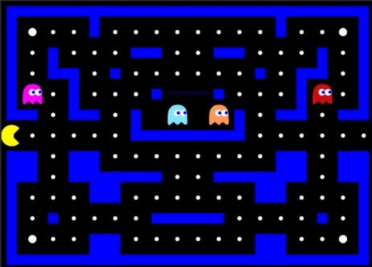
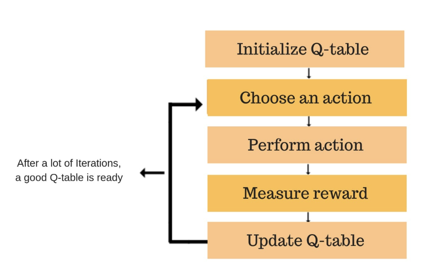
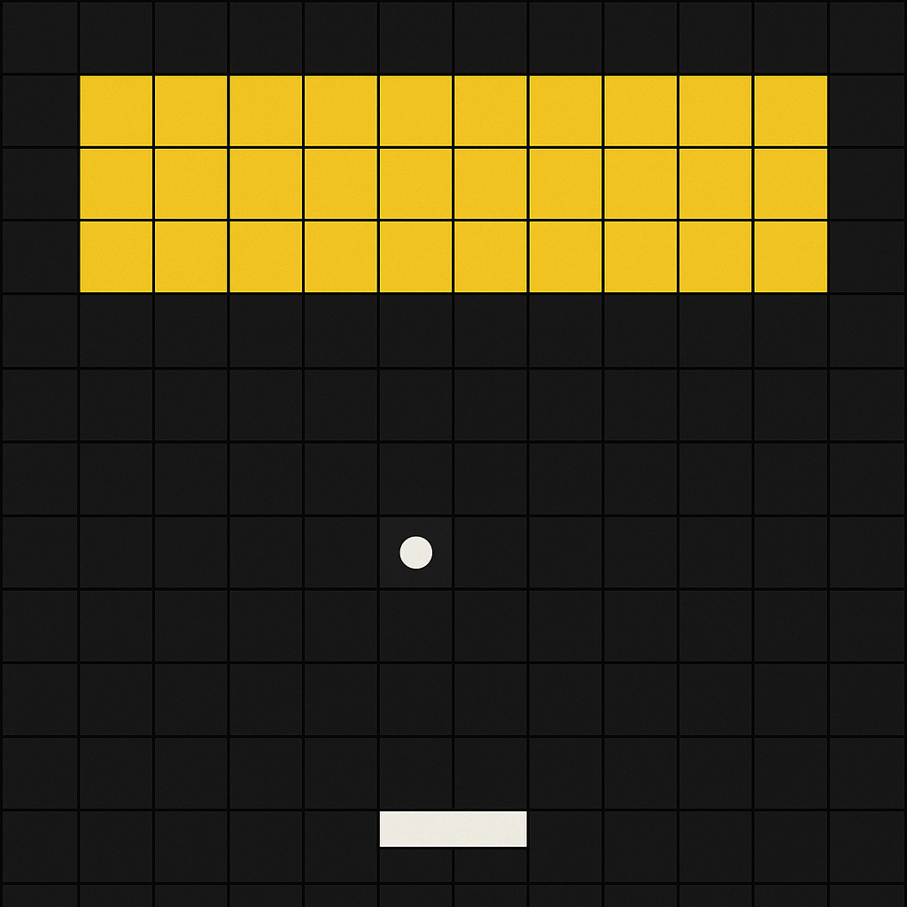
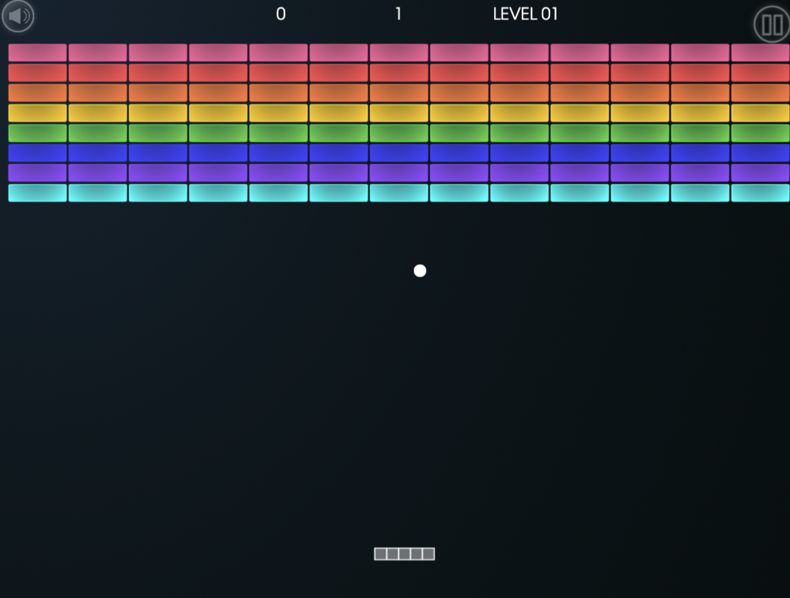
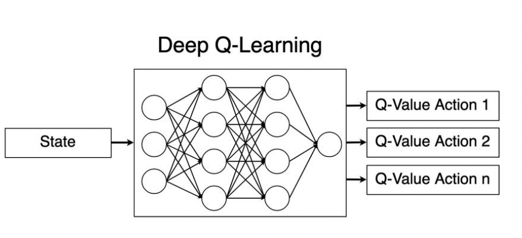
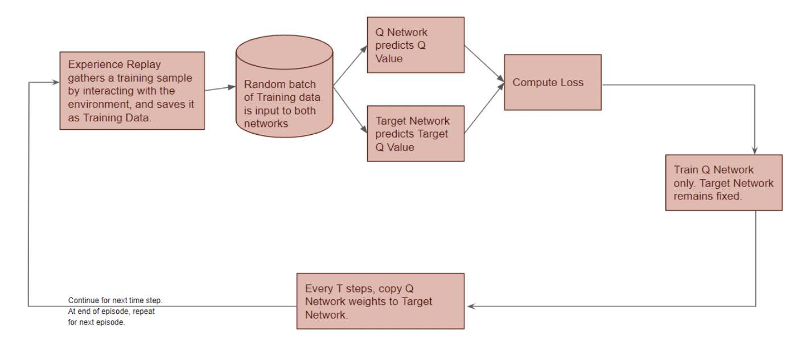
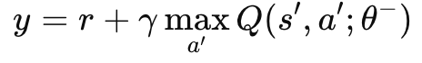
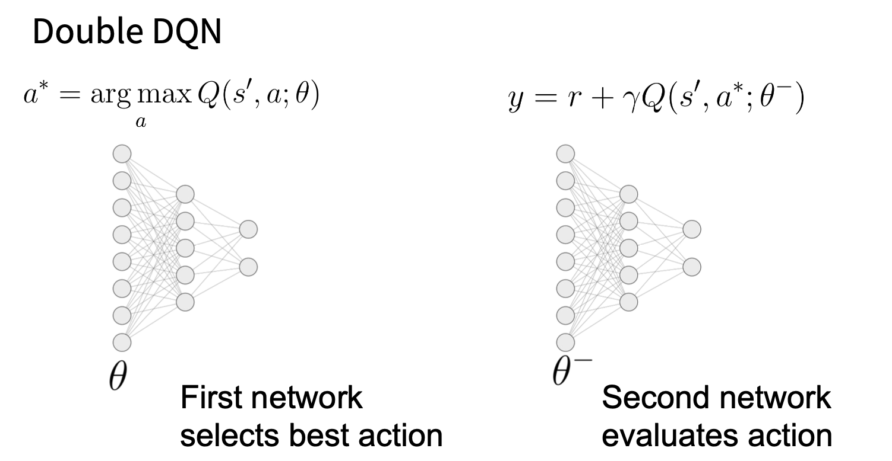

# Introduction
To understand Deep Q-Learning, it's helpful to first grasp the basics of Q-Learning.

Imagine you're teaching a robot to play a game like Pacman. In traditional Q-Learning, the robot keeps a big table (called a Q-table) that tells it how good each move is from every situation it might see. It learns this table over time by playing the game, getting rewards, and updating the table based on what worked.

But this only works if the number of possible situations (states) is small and manageable. What if Pacman plays in a huge maze, or in a 3D world with endless possibilities? The table would be way too big — you'd never finish filling it in.

That’s where Deep Q-Learning comes in.

Instead of using a table, we use a deep neural network to approximate the table. The network takes the current game screen (state) as input and predicts the value of each possible move. It learns to do this by playing the game and adjusting its weights, much like how the Q-table gets updated.

## Intuition: From Q-Tables to Deep Q-Learning

Let’s assume we are training a Pacman agent to find the optimal path to win the game. Reinforcement learning (RL) is a suitable framework for this task because it allows the agent to learn from rewards associated with its actions.

### Q-Learning in the Context of Pacman

| **Q-learning Concept**        | **Pacman Analogy**                                                                 |
|------------------------------|------------------------------------------------------------------------------------|
| **State \( s \)**             | Pacman's current position and nearby ghosts/pellets on the maze                    |
| **Action \( a \)**            | Move up, down, left, or right                                                      |
| **Reward \( r \)**            | +10 for eating a pellet, +50 for eating a ghost, -500 for getting caught by ghost |
| **Q-table \( Q(s, a) \)**     | A big table where Pacman stores how good each move is from each situation          |
| **Learning update equation** | \( Q(s, a) \leftarrow Q(s, a) + \alpha [r + \gamma \max_{a'} Q(s', a') - Q(s, a)] \) |
| **Goal**                      | Learn which moves (actions) lead to the most points (long-term rewards)           |
| **Exploration**               | Sometimes Pacman tries random moves (ϵ-greedy) to discover better paths            |
| **Convergence**               | After many games, Pacman learns to play optimally — avoiding ghosts and eating more pellets |

[ADL,2018, https://www.freecodecamp.org/news/an-introduction-to-q-learning-reinforcement-learning-14ac0b4493cc/]

  Q-learning teaches Pacman how to play optimally by letting him learn from experience. At the start, Pacman initializes a Q-table that keeps track of how good each move is in every situation. At each step, he chooses an action (like moving up, down, left, or right), performs it, and receives a reward such as +10 for eating a pellet or -500 for getting caught. Then, he updates the Q-table using the learning rule, which adjusts the value based on future rewards. Over many episodes, this loop of choosing actions, measuring rewards, and updating the Q-table allows Pacman to converge on the best strategy—maximizing long-term points by avoiding ghosts and targeting pellets efficiently.

Now we want to check if Q-learning works for problems with more complicated state space. 

## A scenario where Q-learning doesn't work:

Let's consider the case of Atari Breakout.

A very simple version of the game might look like this:  

The game is played on a small **12×12 grid**, with **yellow bricks** arranged in the top rows, a **white ball** that moves in all directions, and a **paddle** at the bottom that can move **left**, **right**, or **stay in place**. The goal is to break all the yellow blocks using the paddle in a **single attempt** (i.e., one life).

We can represent each state as a combination of:
- Ball position: 12 × 12 = **144**
- Ball direction: 8 directions (up, down, left, right, and 4 diagonals)
- Paddle position: 11 (on a 12-column grid, assuming paddle length 2)

**Total states** = 12 × 12 × 8 × 11 = **12,672**

The agent (paddle) can take **3 actions**: `move left`, `move right`, or `stay`.

**Total state-action pairs** = 12,672 × 3 = **38,016**

This is small enough for **Q-Learning to be feasible** using a tabular approach. However, this is a very **simplified** version of Atari Breakout. 

The **standard version** uses a much larger **84×84 grid**, which increases:

- Ball positions: from `144` to `7,056`
- Paddle positions: from `11` to `83` (assuming paddle length 2)

**Total states (standard)** = 7,056 × 8 × 83 = **4,682,112**  
**Total state-action pairs (standard)** = 4,682,112 × 3 ≈ **14 million**

This makes it **infeasible to build a Q-table** due to memory and exploration constraints.

Further complexity arises from:
- Tracking the status of each brick (on/off)
- Score multipliers or bonuses
- Ball speed or power-ups

These factors further **inflate the state space**, making the use of lookup tables in high dimensional environments infeasible.

---

### From Q-learning to Deep Q-learning

# Deep Q-Learning = Q-learning + Key Enhancements

**1. Q function Approximation via Neural Network**

- In traditional Q-learning: Q value is stored in a **table**.

- In Deep Q-Learning:Q value is predicted by a **neural network** with parameters `ϕ`.

This introduces the need for **gradient descent** to update the network parameters

**2. Gradient Descent (loss based learning)**

- Since you're predicting Q-values with a network, you define a **loss function**.
- You update the network weights using **gradient descent**.

**3. Replay Buffer**

- Unlike tabular Q-learning (which uses each experience only once), Deep Q-Learning uses a **replay buffer** to store past transitions.

> So far, implementing a neural network and applying gradient descent using a loss function may sound familiar, as these concepts are commonly introduced in deep learning. However, what exactly is a replay buffer?
> 
> In **tabular Q-learning**:
> - The agent learns one step at a time. It sees what happens after an action and immediately updates its Q-table using that single experience. Once that update is done, the experience is gone — never used again.
>
>  In **Deep Q-learning**:
>  - We use a replay buffer like a notebook. Every time the agent has an experience — like moving in a direction and getting a reward — it writes it down in the notebook (the buffer). Later, instead of learning only from the newest experience, it randomly picks past experiences from this notebook to train the neural network.
>
> 

---

Let’s now take a closer look at how Deep Q-Learning works in detail.

---

## Generalizing with Deep Q-Learning

As you saw it in the Atari Breakout example, when the **state space becomes exponentially large**, maintaining a Q-table becomes infeasible due to the curse of dimensionality and computationali efficiency. To address this, we replace the Q-table with a **function approximator**—typically a **deep neural network**—that learns general patterns in the data.

[Deep Q-learning lecture slide]

 The diagram above shows the high-level structure: the network takes in a **state** and **action**, and outputs a **Q-value** estimate.

### 1. State Representation

The **state** encodes the current observation of the environment.

- For example, in **Atari Breakout**, a state could be a stack of the **last 4 grayscale frames**, each sized \( 84 \times 84 \) pixels.
- This allows the agent to capture motion and temporal dynamics.

The flattened feature vector is then passed to the Deep Q-Network to estiamte Q-values for each action.

### 2. Action Representation

The agent has a set of **discrete actions** it can take, such as:

- Move Left
- Move Right
- Do Nothing

Instead of feeding the action into the network as a separate input, the network receives only the **state** and outputs Q-values for **all possible actions** in that state.

### 2. Deep Q-Network
Deep Q-Learning utilizes two different Deep Q-Networks. 

#### a. Policy Q-Network

- The **main neural network** used for action selection.
- Follows an **ε-greedy policy**: sometimes acts greedily, sometimes explores.
- **Updated after every training step** using mini-batches from the replay buffer.

#### b. Target Q-Network

- A **stable copy** of the policy network.
- Used to compute the **target Q-value** in the Bellman update.
- **Updated less frequently** (e.g., every few thousand steps) to provide stable targets and reduce oscillations.

### 3. Q value

The Q-value represents the expected **cumulative future reward** the agent can earn from a given state-action pair, assuming it acts optimally thereafter.

This estimation guides the agent’s decisions, aiming to choose actions that maximize long-term gain rather than short-term reward.

---

## Training Deep Q-Learning in Atari Breakout

Now that we’ve examined each component of the Deep Q-Learning architecture, let’s walk through how the model is trained — step by step — in the context of Atari Breakout.

Following is a general high level workflow of training deep Q network. 

[Ketan Doshi, 2020, https://towardsdatascience.com/reinforcement-learning-explained-visually-part-5-deep-q-networks-step-by-step-5a5317197f4b/]

## High-Level DQN Workflow 

| **Step** | **Description** |
|---------|-----------------|
| **1. Observe State** | The agent looks at the current state of the environment (like a game frame). |
| **2. Select Action (ε-greedy)** | The agent either chooses a random action to explore or picks the best-known action to exploit what it has learned. |
| **3. Execute Action & Store Transition** | The agent performs the action, receives a reward and next state, and saves this experience in the Replay Buffer. |
| **4. Sample Mini-Batch** | The agent randomly selects past experiences from the Replay Buffer to prepare for training. |
| **5. Compute Target Q-Values** | For each experience, the agent calculates how good the next state might be. |
| **6. Compute Predicted Q-Values** | The agent predicts how good its action was in the current state. |
| **7. Compute Loss & Update Main Network** | The agent compares what it predicted with what it should have predicted and adjusts the network to learn. |
| **8. Update Target Network** | Occasionally, the agent updates its helper network to keep learning stable. |
| **Loop** | This process is repeated over many steps so the agent can keep learning better strategies. |

### Atari Breakout

#### Step 1. **Initialize Components**

Training a Deep Q-Learning agent for Atari Breakout begins by setting up the foundational components. A **Replay Buffer** `D` is initialized to store the agent’s experiences in the form of transitions `(state, action, reward, next state)`. These transitions will later be sampled during training. Alongside the buffer, two neural networks are created: the **Main Q-Network**, which is trained to predict Q-values, and the **Target Q-Network**, which is initially a copy of the main network and used to provide stable learning targets. The weights of the Main Q-Network are randomly initialized.

#### Step 2. **Preprocess Game Input**

Atari Breakout provides RGB game frames that are large and high-resolution. To simplify the input and speed up training, each frame is first converted to grayscale and resized to `84 × 84` pixels. Then, to help the agent understand movement — such as the speed and direction of the ball — the last 4 frames are **stacked** into a single input tensor of shape `4 × 84 × 84`. This tensor captures short-term temporal dynamics. The stacked input is passed through a **convolutional neural network (CNN)**, which outputs a Q-value for each possible action the agent can take.

#### Step 3. **Action Selection (Exploration vs. Exploitation)**

In Breakout, the agent can perform one of three discrete actions: **move left**, **move right**, or **do nothing** (keep the paddle still). To decide which action to take, the agent follows an **ε-greedy policy**. Early in training, it chooses actions randomly with a high value of ε (e.g., 1.0), ensuring broad exploration of the state space. Over time, ε decays (e.g., to 0.1), and the agent begins exploiting what it has learned by selecting the action with the highest predicted Q-value. This balance helps the agent discover effective strategies while avoiding premature convergence.

#### Step 4. **Play and Store Experience**

After selecting an action, the agent executes it in the Breakout game environment. Depending on the outcome, it receives a **reward** — for example, hitting a brick yields a positive reward, while missing the ball may give no reward or a penalty. The agent also observes the **next state**, which becomes the basis for the next decision. The full transition — including the original state, the action taken, the reward, and the resulting next state — is stored in the **Replay Buffer**. This buffer will later provide a diverse set of experiences for training the Q-network.

#### Step 5. **Sample Mini-Batch & Compute Targets**

To train the network, the agent randomly samples a batch of past transitions from the Replay Buffer. Random sampling helps break the correlation between consecutive frames, which could otherwise destabilize learning. For each sampled transition, the agent computes a **target Q-value**, which estimates how good a given action was based on the next state. These targets are then compared to the Q-values predicted by the Main Q-Network, and the difference (loss) is used to update the network’s parameters via gradient descent. This process repeats continuously, allowing the agent to learn how to maximize its cumulative reward over time.

>  ### Did you notice how the Replay Buffer is used here?

> - In **Step 3**, the agent interacts with the environment and generates a transition:  
  `(sₜ, aₜ, rₜ, sₜ₊₁)`
> - This experience is **stored in the Replay Buffer `D`**.
> - In **Step 5**, a **random mini-batch** of experiences is **sampled from `D`** to compute target Q-values and train the Q-network.

> --> Breaks correlation between sequential experiences

> --> Introduces diversity in training batches and help the network generalize better

---

## Overestimation in DQN

Deep Q-Networks don’t always make perfect predictions — sometimes they guess that an action is better than it actually is. This is called **overestimation bias**.

When the network updates its Q-values, it looks at the next state and picks the action that has the highest predicted value — using the same network to both choose the best action and evaluate how good that action is. If any of the Q-values are slightly too high (which often happens due to noise or error), the network tends to always pick those overestimated actions.

> This happens because the target Q-value is computed using:  
>

> In this formulation, the same target network \( \theta^{-} \) is used for both **selecting the best action** (via `max`) and **evaluating its value**.  
> If the Q-values are noisy or inaccurate, the `max` operation tends to **select actions with overestimated values**, resulting in an overly optimistic target. This systematic bias can accumulate over time and degrade learning performance.

 Over time, this builds up, and the network keeps getting more and more confident about actions that may not actually be very good.

### Double DQN

[Deep Q-learning lecture slide]

To go about the issue of the overestimation bias, we can use a Double DQN, which decouples action selection and evaluation through two networks as shown in the figure above. Research shows that by doing so, it reduces over-estimation and stabilizes overall training.

#### Intuition: Analogy with Archery Contest
Assume there are 100 archers who have the same skill level and are assigned to shoot at a target. However, there is always a gust of wind blowing 3mph. 

Method 1 (DQN-style) lets each archer fire one arrow, and chooses the archer whose arrow landed closest to the center of the target. 

Method 2 (Double DQN) selects the same archer that landed the closest, but makes the archer fire again to evaluate their accuracy. 

The problem with method 1 is that the archer might just have gotten lucky due to the uncontrollable wind, leading to the method potentially overestimating the archer's true skill. The second method goes about this problem by selecting the same archer, but makes sure to not "double-count" the wind noise in the second round. 

## Final Overview

Let’s take a step back and review how everything fits together, especially how Q-Learning evolved into Deep Q-Learning and then into Double DQN.

1. **Q-Learning**  
   - This is the most basic version. It uses a lookup table (called a Q-table) to store the value of each action in each state.  
   - It works well for simple environments but breaks down when there are too many states to keep track of.

2. **Deep Q-Learning (DQN)**  
   - Instead of a table, DQN uses a neural network to estimate Q-values, which means it can handle huge state spaces like raw pixel inputs from Atari games.  
   - It adds two key techniques to stabilize learning: **experience replay** (reusing past experiences) and a **target network** (to avoid chasing moving targets).

3. **Double DQN**  
   - One problem with DQN is that it tends to overestimate Q-values, which can make learning unstable.  
   - Double DQN fixes this by separating the networks used to choose and evaluate actions. This leads to more accurate Q-value estimates and better performance.

## References 

Following has a great explanation on how deep Q-learning networks are trained: 

https://towardsdatascience.com/reinforcement-learning-explained-visually-part-5-deep-q-networks-step-by-step-5a5317197f4b/

